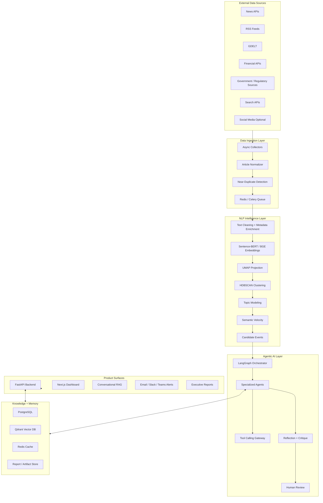
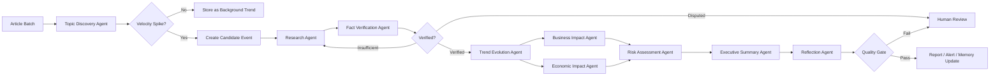
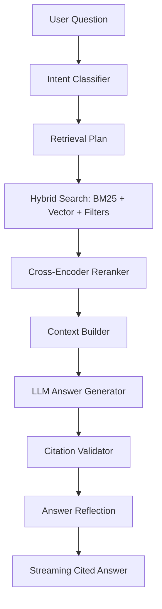
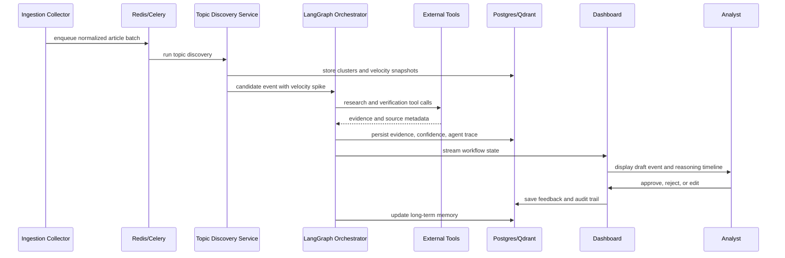
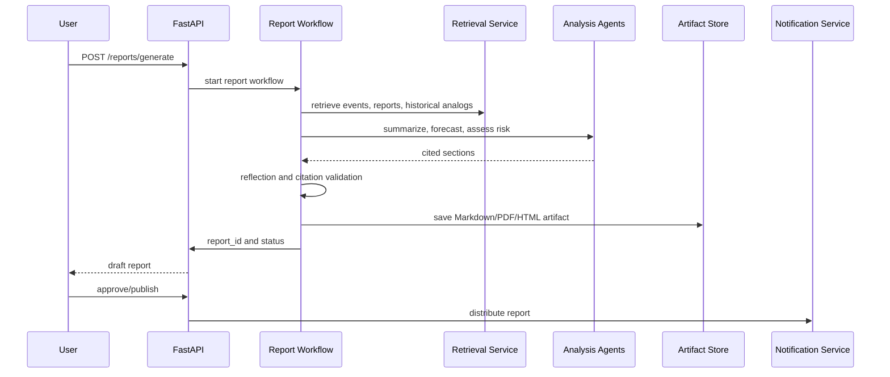
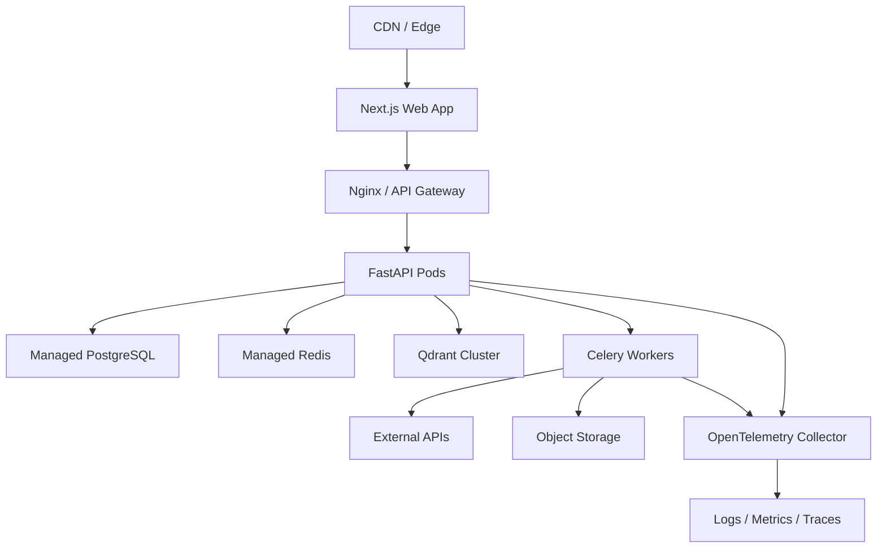

# Autonomous News Intelligence Platform

## 1. Product Vision

The existing Dynamic Trend & Event Detector becomes the core discovery engine inside an enterprise-grade autonomous News Intelligence Platform. The product continuously ingests global news, detects emerging events, verifies evidence, reasons about economic and business impact, forecasts trend evolution, generates cited executive intelligence, sends alerts, and learns from analyst feedback.

The platform is designed for intelligence teams, strategy teams, risk teams, market researchers, policy analysts, and executives who need fast, trustworthy answers to questions such as:

- What events are emerging before they become mainstream?
- Which topics are accelerating fastest by geography, industry, or company?
- Is this a verified real-world event, a rumor, or a short-lived media spike?
- What similar events happened before, and how did they evolve?
- Which companies, industries, regions, and economic indicators may be affected?
- What should an executive know today, with citations and confidence?

The original research pipeline is not replaced. It becomes the Topic Discovery Engine: a high-signal classical NLP subsystem that gives the agentic layer structured candidate events, velocity scores, topic clusters, temporal signals, and GDELT verification evidence.

## 2. System Architecture

### High-Level Architecture



### Core Services

- `ingestion-service`: pulls articles from APIs, RSS, GDELT, financial news, and government sources.
- `topic-discovery-service`: wraps the existing Sentence-BERT, UMAP, HDBSCAN, BERTopic, semantic velocity, and GDELT verification workflow.
- `agent-orchestrator-service`: runs LangGraph workflows for research, verification, impact analysis, forecasting, reporting, and alerting.
- `retrieval-service`: performs hybrid retrieval over historical news, verified events, company profiles, reports, and memory.
- `memory-service`: persists event memory, agent observations, analyst feedback, corrections, confidence history, and event relationships.
- `reporting-service`: generates daily, weekly, breaking-news, risk, company, and industry reports with citations.
- `notification-service`: routes approved alerts to email, Slack, Teams, Telegram, Discord, or webhooks.
- `api-gateway`: FastAPI interface for dashboard, chat, reports, analyst review, and admin functions.
- `web-app`: Next.js operational dashboard with event feeds, maps, timelines, reasoning traces, reports, and chat.

## 3. Multi-Agent Design

### Agent Operating Contract

Every agent follows a shared contract:

- Input: typed Pydantic model with event/topic context, user intent, evidence state, memory references, and deadline.
- Output: typed Pydantic model with conclusion, confidence, citations, uncertainty, next actions, and failure state.
- Tools: accessed through a tool gateway with rate limits, auth, tracing, retries, and source allowlists.
- Memory: reads only relevant memory slices and writes structured observations.
- Failure handling: returns partial evidence, degraded confidence, and human-review recommendations instead of silent failure.
- Observability: logs prompt version, model, token count, latency, tool calls, cost, citations, and confidence changes.

### Agents

| Agent | Responsibilities | Inputs | Outputs | Tools | Memory Usage | Failure Handling |
|---|---|---|---|---|---|---|
| Topic Discovery Agent | Convert streaming articles into topic clusters and candidate events using the existing NLP pipeline. | Article batches, source metadata, time window. | Topic clusters, velocity scores, keywords, sample articles, candidate event IDs. | Sentence-BERT, UMAP, HDBSCAN, BERTopic, GDELT API. | Writes discovered topics and velocity history. | Falls back to previous model snapshot or smaller batch mode. |
| Research Agent | Gather external context for candidate events. | Candidate event, keywords, geography, entities. | Evidence bundle, source summaries, citation candidates. | Search, Tavily, News APIs, Wikipedia, GDELT, government sources. | Reads similar past events and trusted source preferences. | Marks source gaps and requests additional collection. |
| Fact Verification Agent | Assess whether claims are supported by independent sources. | Event claims, evidence bundle. | Verification status, contradiction list, confidence score. | GDELT, search, official sources, fact-checking APIs, source credibility registry. | Stores corrections and disputed claims. | Escalates to human review if evidence conflicts. |
| Trend Evolution Agent | Model whether an event is accelerating, decaying, or spreading. | Topic time series, velocity, related events. | Growth stage, likely trajectory, expected duration. | Forecasting models, historical event memory, retrieval. | Reads prior trajectories and writes forecasts. | Emits scenario ranges instead of single-point forecasts. |
| Business Impact Agent | Identify company, sector, supply-chain, and market implications. | Verified event, entities, region, industry. | Impact memo, affected companies, severity, opportunities. | Company profiles, SEC filings, financial APIs, market data, search. | Reads company-event exposure memory. | Lowers confidence when entity matching is weak. |
| Economic Impact Agent | Analyze macroeconomic and policy implications. | Event, geography, sector, historical analogs. | Economic indicators affected, policy risks, macro outlook. | World Bank, FRED, IMF, government statistics, retrieval. | Reads macro timelines and prior shocks. | Requests analyst review for low-source economic claims. |
| Risk Assessment Agent | Score operational, reputational, market, regulatory, geopolitical, and misinformation risks. | Verified event, impact outputs. | Risk score, risk drivers, mitigation suggestions. | Risk taxonomy, retrieval, source credibility registry. | Updates risk history by event type. | Produces conservative confidence and flags missing evidence. |
| Executive Summary Agent | Produce concise decision-ready summaries. | Verified event, research, impact, risk, forecast. | Executive brief with citations and confidence. | RAG retriever, citation formatter. | Reads executive style preferences and past edits. | Rejects unsupported claims during self-check. |
| Report Generator Agent | Build daily, weekly, breaking, company, industry, and risk reports. | Report scope, event set, audience. | Markdown/PDF/HTML report, citation appendix. | Report templates, RAG, chart service, object store. | Learns section ordering and analyst edits. | Generates draft status until citations validate. |
| Notification Agent | Decide alert routing and urgency. | Event severity, watchlists, user preferences. | Alert payloads, channels, delivery status. | Email, Slack, Teams, Telegram, Discord, webhooks. | Reads user subscriptions and previous alert feedback. | Queues retry and suppresses duplicate alerts. |
| Memory Manager Agent | Consolidate event memory and analyst feedback. | Agent outputs, feedback, corrections. | Updated memory records and relationships. | PostgreSQL, Qdrant, graph relations. | Owns long-term memory writes. | Uses idempotency keys to avoid duplicate memory. |
| Reflection Agent | Critique evidence, reasoning, source quality, and confidence. | Full workflow state. | Critique, confidence adjustment, human-review flag. | Source registry, citation checker, policy rules. | Stores recurring failure patterns. | Blocks publishing if quality gates fail. |
| Human Feedback Agent | Capture analyst approval, rejection, edits, and labels. | Draft outputs and analyst actions. | Feedback records, training labels, corrected claims. | Dashboard review UI, annotation API. | Stores preference and correction memory. | Preserves original and corrected versions for audit. |

### Agent Prompt Pattern

Each agent uses a structured prompt with:

- Role and operating boundaries.
- Task-specific objective.
- Required inputs and unavailable-data behavior.
- Tool-use policy.
- Citation requirements.
- Confidence scoring rubric.
- Output JSON schema.
- Self-check instructions.

Example prompt skeleton:

```text
You are the {agent_name} in an enterprise news intelligence system.

Objective:
{task_objective}

Context:
{typed_context}

Available tools:
{tool_manifest}

Rules:
1. Use tools when the provided context is insufficient.
2. Prefer primary and official sources when available.
3. Separate verified facts from inference.
4. Attach citations to factual claims.
5. Return lower confidence when sources conflict or coverage is thin.
6. Request human review for high-impact claims with weak evidence.

Return only valid JSON matching this schema:
{output_schema}
```

## 4. Database Schema

PostgreSQL stores canonical structured data. Qdrant stores embeddings for articles, chunks, events, reports, company profiles, memory summaries, and analyst corrections. Redis supports queues, caches, rate limits, locks, and streaming workflow state.

### Relational Tables

```sql
CREATE TABLE sources (
    id UUID PRIMARY KEY,
    name TEXT NOT NULL,
    source_type TEXT NOT NULL,
    base_url TEXT,
    credibility_score NUMERIC(4,3) DEFAULT 0.500,
    country TEXT,
    language TEXT DEFAULT 'en',
    created_at TIMESTAMPTZ DEFAULT now()
);

CREATE TABLE articles (
    id UUID PRIMARY KEY,
    source_id UUID REFERENCES sources(id),
    external_id TEXT,
    url TEXT UNIQUE,
    title TEXT NOT NULL,
    description TEXT,
    body TEXT,
    author TEXT,
    published_at TIMESTAMPTZ,
    collected_at TIMESTAMPTZ DEFAULT now(),
    language TEXT,
    country TEXT,
    category TEXT,
    canonical_hash TEXT,
    metadata JSONB DEFAULT '{}'
);

CREATE TABLE article_chunks (
    id UUID PRIMARY KEY,
    article_id UUID REFERENCES articles(id) ON DELETE CASCADE,
    chunk_index INT NOT NULL,
    text TEXT NOT NULL,
    token_count INT,
    qdrant_point_id UUID,
    created_at TIMESTAMPTZ DEFAULT now()
);

CREATE TABLE topic_clusters (
    id UUID PRIMARY KEY,
    model_version TEXT NOT NULL,
    label TEXT,
    keywords TEXT[] NOT NULL,
    centroid_qdrant_point_id UUID,
    coherence_score NUMERIC(6,4),
    hdbscan_cluster_id INT,
    created_at TIMESTAMPTZ DEFAULT now()
);

CREATE TABLE topic_article_links (
    topic_id UUID REFERENCES topic_clusters(id) ON DELETE CASCADE,
    article_id UUID REFERENCES articles(id) ON DELETE CASCADE,
    membership_score NUMERIC(6,5),
    PRIMARY KEY (topic_id, article_id)
);

CREATE TABLE semantic_velocity_snapshots (
    id UUID PRIMARY KEY,
    topic_id UUID REFERENCES topic_clusters(id),
    window_start TIMESTAMPTZ NOT NULL,
    window_end TIMESTAMPTZ NOT NULL,
    article_count INT NOT NULL,
    velocity_score NUMERIC(10,5) NOT NULL,
    acceleration_score NUMERIC(10,5),
    baseline_score NUMERIC(10,5),
    anomaly_score NUMERIC(10,5),
    created_at TIMESTAMPTZ DEFAULT now()
);

CREATE TABLE events (
    id UUID PRIMARY KEY,
    topic_id UUID REFERENCES topic_clusters(id),
    title TEXT NOT NULL,
    summary TEXT,
    status TEXT NOT NULL CHECK (status IN ('candidate','researching','verified','disputed','rejected','archived')),
    severity TEXT CHECK (severity IN ('low','medium','high','critical')),
    confidence NUMERIC(4,3) NOT NULL DEFAULT 0.500,
    first_seen_at TIMESTAMPTZ,
    last_seen_at TIMESTAMPTZ,
    geography JSONB DEFAULT '{}',
    entities JSONB DEFAULT '{}',
    created_at TIMESTAMPTZ DEFAULT now(),
    updated_at TIMESTAMPTZ DEFAULT now()
);

CREATE TABLE event_evidence (
    id UUID PRIMARY KEY,
    event_id UUID REFERENCES events(id) ON DELETE CASCADE,
    article_id UUID REFERENCES articles(id),
    source_url TEXT,
    claim TEXT NOT NULL,
    evidence_text TEXT,
    evidence_type TEXT,
    stance TEXT CHECK (stance IN ('supports','contradicts','unclear')),
    reliability_score NUMERIC(4,3),
    created_at TIMESTAMPTZ DEFAULT now()
);

CREATE TABLE agent_runs (
    id UUID PRIMARY KEY,
    event_id UUID REFERENCES events(id),
    workflow_id UUID,
    agent_name TEXT NOT NULL,
    prompt_version TEXT,
    model_name TEXT,
    input JSONB NOT NULL,
    output JSONB,
    status TEXT NOT NULL,
    latency_ms INT,
    prompt_tokens INT,
    completion_tokens INT,
    estimated_cost_usd NUMERIC(12,6),
    trace_id TEXT,
    created_at TIMESTAMPTZ DEFAULT now()
);

CREATE TABLE tool_calls (
    id UUID PRIMARY KEY,
    agent_run_id UUID REFERENCES agent_runs(id) ON DELETE CASCADE,
    tool_name TEXT NOT NULL,
    input JSONB,
    output JSONB,
    status TEXT NOT NULL,
    latency_ms INT,
    error TEXT,
    created_at TIMESTAMPTZ DEFAULT now()
);

CREATE TABLE event_memories (
    id UUID PRIMARY KEY,
    event_id UUID REFERENCES events(id),
    memory_type TEXT NOT NULL,
    content TEXT NOT NULL,
    qdrant_point_id UUID,
    confidence NUMERIC(4,3),
    valid_from TIMESTAMPTZ DEFAULT now(),
    valid_to TIMESTAMPTZ,
    created_at TIMESTAMPTZ DEFAULT now()
);

CREATE TABLE event_relationships (
    id UUID PRIMARY KEY,
    source_event_id UUID REFERENCES events(id),
    target_event_id UUID REFERENCES events(id),
    relation_type TEXT NOT NULL,
    strength NUMERIC(4,3),
    rationale TEXT,
    created_at TIMESTAMPTZ DEFAULT now()
);

CREATE TABLE reports (
    id UUID PRIMARY KEY,
    report_type TEXT NOT NULL,
    title TEXT NOT NULL,
    audience TEXT,
    content_markdown TEXT NOT NULL,
    status TEXT NOT NULL CHECK (status IN ('draft','review','approved','published','rejected')),
    citation_manifest JSONB DEFAULT '[]',
    generated_by_workflow_id UUID,
    created_at TIMESTAMPTZ DEFAULT now(),
    published_at TIMESTAMPTZ
);

CREATE TABLE analyst_feedback (
    id UUID PRIMARY KEY,
    target_type TEXT NOT NULL,
    target_id UUID NOT NULL,
    analyst_id UUID,
    action TEXT NOT NULL CHECK (action IN ('approve','reject','edit','correct','label','comment')),
    original_content JSONB,
    corrected_content JSONB,
    feedback_text TEXT,
    created_at TIMESTAMPTZ DEFAULT now()
);

CREATE TABLE user_watchlists (
    id UUID PRIMARY KEY,
    user_id UUID NOT NULL,
    name TEXT NOT NULL,
    keywords TEXT[],
    entities JSONB DEFAULT '{}',
    geographies TEXT[],
    industries TEXT[],
    min_severity TEXT DEFAULT 'medium',
    channels JSONB DEFAULT '{}',
    created_at TIMESTAMPTZ DEFAULT now()
);
```

### Qdrant Collections

| Collection | Vector | Payload |
|---|---|---|
| `article_chunks` | BGE/OpenAI/SBERT chunk embedding | article_id, source_id, published_at, title, url, entities, country |
| `event_summaries` | Event summary embedding | event_id, status, confidence, severity, first_seen_at, industries |
| `company_profiles` | Company/profile chunk embedding | company_id, ticker, sector, geography |
| `reports` | Report section embedding | report_id, report_type, published_at, citations |
| `agent_memory` | Memory summary embedding | event_id, memory_type, confidence, validity window |
| `analyst_corrections` | Correction embedding | feedback_id, target_type, action, analyst_id |

## 5. API Design

All APIs are versioned under `/api/v1`. Authentication uses Clerk or Auth.js on the frontend and JWT validation in FastAPI. Internal services authenticate with signed service tokens.

### Event APIs

| Method | Path | Purpose |
|---|---|---|
| `GET` | `/events` | List events with filters for status, severity, topic, time, geography, entity, and confidence. |
| `GET` | `/events/{event_id}` | Get event details, evidence, timeline, forecast, impact, and memory. |
| `POST` | `/events/{event_id}/verify` | Trigger verification workflow. |
| `POST` | `/events/{event_id}/analyze-impact` | Trigger business/economic/risk analysis. |
| `POST` | `/events/{event_id}/forecast` | Trigger trend evolution forecast. |
| `POST` | `/events/{event_id}/feedback` | Submit analyst feedback. |

### Topic APIs

| Method | Path | Purpose |
|---|---|---|
| `GET` | `/topics` | List topic clusters and velocity metrics. |
| `GET` | `/topics/{topic_id}` | Get topic keywords, articles, cluster metadata, coherence, and velocity history. |
| `POST` | `/topics/discover` | Start batch or streaming topic discovery. |

### RAG and Chat APIs

| Method | Path | Purpose |
|---|---|---|
| `POST` | `/chat/query` | Conversational RAG over historical news, events, reports, and memory. |
| `POST` | `/retrieval/search` | Hybrid search with filters and re-ranking. |
| `GET` | `/memory/similar-events/{event_id}` | Find historically similar events and outcomes. |

### Report APIs

| Method | Path | Purpose |
|---|---|---|
| `POST` | `/reports/generate` | Generate a daily, weekly, breaking, company, industry, or risk report. |
| `GET` | `/reports` | List reports. |
| `GET` | `/reports/{report_id}` | Fetch report with citations and approval status. |
| `POST` | `/reports/{report_id}/approve` | Approve report for publication. |
| `POST` | `/reports/{report_id}/publish` | Publish and notify subscribed users. |

### Workflow APIs

| Method | Path | Purpose |
|---|---|---|
| `GET` | `/workflows/{workflow_id}` | Inspect LangGraph state, agent activity, tool calls, and errors. |
| `GET` | `/workflows/{workflow_id}/stream` | Server-sent events stream for live reasoning visualization. |
| `POST` | `/workflows/{workflow_id}/retry` | Retry failed node with preserved context. |

## 6. Folder Structure

```text
Dynamic-Event-Detector/
├── apps/
│   ├── web/                         # Next.js, React, TypeScript, Tailwind, shadcn/ui
│   └── api/                         # FastAPI application
├── services/
│   ├── ingestion/                   # News, RSS, GDELT, financial, gov collectors
│   ├── topic_discovery/             # Existing SBERT/UMAP/HDBSCAN/semantic velocity pipeline
│   ├── agents/                      # LangGraph workflows and agent nodes
│   ├── retrieval/                   # Hybrid RAG, reranking, citation generation
│   ├── memory/                      # Event memory, feedback memory, relationship extraction
│   ├── reporting/                   # Report generation and export
│   └── notifications/               # Email, Slack, Teams, Telegram, Discord
├── packages/
│   ├── schemas/                     # Shared Pydantic models and OpenAPI types
│   ├── observability/               # OpenTelemetry, LangSmith, cost tracking
│   ├── security/                    # Auth, RBAC, secrets, source allowlists
│   └── common/                      # Config, logging, errors, pagination
├── src/                             # Current research modules retained during migration
│   ├── preprocessing.py
│   ├── models.py
│   ├── gdelt.py
│   └── visualization.py
├── notebooks/                       # Research experiments and model evaluation
├── reports/                         # Research paper, generated reports, benchmark outputs
├── docs/
│   ├── enterprise_news_intelligence_platform.md
│   ├── api.md
│   ├── deployment.md
│   └── model_cards.md
├── infra/
│   ├── docker/
│   ├── nginx/
│   ├── postgres/
│   ├── qdrant/
│   └── terraform/
├── tests/
│   ├── unit/
│   ├── integration/
│   ├── evals/
│   └── load/
├── docker-compose.yml
├── pyproject.toml
├── package.json
└── README.md
```

## 7. Technology Justification

| Layer | Technology | Rationale |
|---|---|---|
| Frontend | Next.js, React, TypeScript | Production web app with server rendering, typed components, and enterprise UI patterns. |
| Styling | Tailwind CSS, shadcn/ui | Fast, consistent dashboard components with accessible primitives. |
| Data Fetching | React Query | Caching, retries, optimistic updates, and streaming-friendly state. |
| Visualization | Recharts, Plotly, map library | Time series, semantic velocity graphs, cluster exploration, maps, and event timelines. |
| Backend | FastAPI, Pydantic | Typed API contracts, async IO, OpenAPI generation, strong Python AI ecosystem fit. |
| Workflow | LangGraph | Explicit state machines, retries, conditional routing, human review gates, durable agent workflows. |
| Task Queue | Celery + Redis | Reliable background jobs for ingestion, batch topic discovery, reports, and alerts. |
| Relational DB | PostgreSQL | Canonical event, evidence, feedback, workflow, and audit storage. |
| Vector DB | Qdrant | High-performance filtered vector search, payload filters, collection separation, production deployment. |
| Cache | Redis | Rate limits, locks, streaming workflow state, temporary retrieval cache. |
| Models | Configurable frontier LLM gateway | Supports OpenAI/Anthropic/local models behind a provider abstraction. |
| Embeddings | Sentence-BERT, BGE, OpenAI embeddings | SBERT preserves existing research; BGE/OpenAI improve production retrieval quality. |
| Observability | OpenTelemetry, LangSmith | Distributed traces plus LLM-specific prompt/tool/cost observability. |
| Deployment | Docker Compose, Nginx, GitHub Actions | Reproducible local and cloud deployments with clear CI/CD path. |

## 8. AI Workflow Diagrams

### Event Intelligence Workflow



### Conversational RAG Workflow



## 9. Sequence Diagrams

### Breaking Event Detection



### Executive Report Generation



## 10. LangGraph Workflow

### State Model

```python
from typing import Literal
from pydantic import BaseModel, Field

class WorkflowState(BaseModel):
    workflow_id: str
    event_id: str | None = None
    topic_id: str | None = None
    candidate_event: dict | None = None
    research_evidence: list[dict] = Field(default_factory=list)
    verified_claims: list[dict] = Field(default_factory=list)
    disputed_claims: list[dict] = Field(default_factory=list)
    trend_forecast: dict | None = None
    business_impact: dict | None = None
    economic_impact: dict | None = None
    risk_assessment: dict | None = None
    executive_summary: dict | None = None
    reflection: dict | None = None
    confidence: float = 0.5
    requires_human_review: bool = False
    status: Literal["running", "blocked", "review", "complete", "failed"] = "running"
```

### Graph Nodes

```text
candidate_event
  -> research
  -> verify
  -> route_verification
      if verified: forecast
      if disputed: human_review
      if insufficient: research
  -> business_impact
  -> economic_impact
  -> risk_assessment
  -> executive_summary
  -> reflection
  -> route_quality
      if pass: publish_outputs
      if fail: human_review
  -> memory_update
  -> end
```

### Reliability Rules

- Every node is idempotent and writes with workflow ID plus node name.
- Tool calls use exponential backoff, per-provider rate limits, and circuit breakers.
- Human review gates pause the graph with serialized state.
- Failed nodes can be retried without recomputing prior successful nodes.
- Agent outputs are schema-validated before entering the next node.
- Published outputs require valid citations for all factual claims.

## 11. Memory Architecture

The memory system separates durable facts from temporary working context.

### Memory Types

| Memory Type | Storage | Examples |
|---|---|---|
| Event Memory | Postgres + Qdrant | Event summary, verified timeline, entities, confidence history. |
| Trend Memory | Postgres + Qdrant | Velocity patterns, topic lifecycle, acceleration/decay curves. |
| Agent Observation Memory | Postgres + Qdrant | Agent conclusions, uncertainty, failed hypotheses. |
| Analyst Feedback Memory | Postgres + Qdrant | Corrections, approved edits, rejected claims, style preferences. |
| Relationship Memory | Postgres | Similar-to, caused-by, escalated-from, contradicts, affects. |
| Working Memory | Redis | Current workflow state, intermediate tool outputs, live UI stream. |

### Memory Retrieval Questions

- What similar event happened before?
- How did the previous event evolve?
- Which forecasts were made, and were they accurate?
- Which sources were reliable during similar events?
- What did analysts correct last time?
- Which companies were affected by analogous events?

### Memory Write Policy

Memory writes are not free-form. The Memory Manager Agent writes structured records with:

- `memory_type`
- `event_id`
- `claim`
- `evidence`
- `confidence`
- `valid_from`
- `valid_to`
- `source_agent`
- `source_run_id`
- `citation_ids`

The Reflection Agent can downgrade, expire, or mark memory as disputed.

## 12. RAG Architecture

### Corpus

RAG covers:

- Historical news articles and chunks.
- Verified events and timelines.
- Topic cluster summaries and semantic velocity snapshots.
- Company profiles and sector taxonomies.
- Economic and government reports.
- Generated executive reports.
- Analyst corrections and approved interpretations.

### Chunking Strategy

- News articles: 400-700 tokens with 80-token overlap, preserving title, published date, source, and paragraph boundaries.
- Reports: section-aware chunks by heading, with citation manifests preserved.
- Company profiles: entity-aware chunks grouped by business segment, geography, products, financials, and risks.
- Event memory: compact summaries plus timeline entries as separate chunks.

### Embedding Models

- Retain Sentence-BERT for continuity with the existing research pipeline.
- Use BAAI/bge-large-en or a current production embedding model for primary RAG retrieval.
- Store model name and version on every vector payload to support re-indexing and evaluation.

### Retrieval Strategy

1. Query understanding: classify intent, timeframe, geography, entities, industries, and required evidence type.
2. Query rewriting: generate focused sub-queries for events, entities, sources, and historical analogs.
3. Hybrid retrieval: combine BM25 keyword search, vector search, metadata filtering, and time decay.
4. Multi-collection retrieval: search articles, events, reports, memory, company profiles, and corrections.
5. Reranking: apply cross-encoder reranker to top candidates.
6. Context packing: prefer diverse sources, primary sources, recent updates, and prior verified memory.
7. Citation generation: attach article/report/source IDs to every factual claim.
8. Answer validation: reject unsupported claims and surface uncertainty.

### Hallucination Reduction

- Require citations for factual claims.
- Separate facts, analysis, and forecasts in outputs.
- Use source reliability scores and conflict detection.
- Run citation validation before publishing.
- Add Reflection Agent review for high-impact outputs.
- Route weak or conflicting evidence to human review.

## 13. Prompt Templates

### Fact Verification Agent

```text
System:
You are a fact verification agent for an enterprise news intelligence platform.
Your job is to determine whether each event claim is supported, contradicted, or unresolved.

Instructions:
- Prefer primary, official, and high-credibility sources.
- Require at least two independent sources for high-impact claims when possible.
- Do not infer facts beyond the supplied evidence.
- Identify contradictions and stale information.
- Return low confidence if sources are thin, circular, anonymous, or conflicting.
- Flag for human review if the event could materially affect markets, safety, policy, or reputation.

Input:
{event}
{claims}
{evidence_bundle}
{source_reliability}

Output JSON:
{
  "verification_status": "verified | disputed | insufficient",
  "verified_claims": [],
  "disputed_claims": [],
  "missing_evidence": [],
  "confidence": 0.0,
  "human_review_required": false,
  "rationale": "",
  "citations": []
}
```

### Business Impact Agent

```text
System:
You analyze business implications of verified news events for executives.

Instructions:
- Identify affected industries, companies, supply chains, customers, competitors, and markets.
- Separate direct impact from second-order impact.
- Use company profiles and cited sources.
- Give severity and time horizon.
- Avoid investment advice.

Input:
{verified_event}
{company_profiles}
{historical_analogs}
{market_context}

Output JSON:
{
  "affected_industries": [],
  "affected_companies": [],
  "impact_drivers": [],
  "opportunities": [],
  "risks": [],
  "time_horizon": "immediate | short_term | medium_term | long_term",
  "severity": "low | medium | high | critical",
  "confidence": 0.0,
  "citations": []
}
```

### Executive Summary Agent

```text
System:
You write concise executive intelligence briefings with citations.

Instructions:
- Lead with what changed, why it matters, and what to watch next.
- Keep facts cited.
- Label forecasts as forecasts.
- Include confidence and major uncertainties.
- Do not include unsupported claims.

Input:
{verified_event}
{research_summary}
{impact_analysis}
{risk_assessment}
{forecast}

Output JSON:
{
  "headline": "",
  "brief": "",
  "why_it_matters": [],
  "key_evidence": [],
  "forecast": "",
  "watch_items": [],
  "confidence": 0.0,
  "citations": []
}
```

### Reflection Agent

```text
System:
You are the quality-control and reflection agent.

Evaluate:
- Is evidence sufficient?
- Are sources reliable and independent?
- Are there alternative explanations?
- Are forecasts clearly separated from facts?
- Is confidence calibrated?
- Should human review be required?

Output JSON:
{
  "passes_quality_gate": false,
  "confidence_adjustment": 0.0,
  "issues": [],
  "missing_checks": [],
  "human_review_required": false,
  "publication_risk": "low | medium | high",
  "rationale": ""
}
```

## 14. Tool Calling Design

### Tool Gateway

Agents do not call external services directly. They call an internal tool gateway that handles:

- Authentication and secret injection.
- Provider-specific rate limits.
- Retries and backoff.
- Response normalization.
- Cost tracking.
- Source allowlists and blocklists.
- PII redaction where required.
- Tracing and audit logs.

### Tool Registry

| Tool | Purpose | Guardrails |
|---|---|---|
| `gdelt.search` | Verify global news coverage and event timelines. | Enforce time filters and query length limits. |
| `news.search` | Retrieve recent news from configured providers. | Deduplicate syndicated articles. |
| `rss.fetch` | Pull trusted publisher feeds. | Source allowlist and cache TTL. |
| `web.search` | Broader external discovery. | Require source reliability scoring. |
| `wikipedia.lookup` | Background entity context. | Never use as sole source for breaking claims. |
| `finance.quote` | Market indicators and public company movement. | No investment recommendation generation. |
| `sec.lookup` | Company filings and disclosures. | Prefer primary filings over summaries. |
| `gov.search` | Government, regulator, and public statistics sources. | Prioritize official domains. |
| `maps.geocode` | Normalize locations and coordinates. | Validate ambiguous geographies. |
| `email.send` | Send reports and alerts. | Requires approved report or alert policy match. |
| `slack.post` | Send team alerts. | Suppress duplicates and include confidence. |
| `calendar.create` | Schedule review or briefing. | Requires user permission. |

## 15. Security Considerations

- Authentication: Clerk or Auth.js with JWT validation in FastAPI.
- Authorization: RBAC roles such as admin, analyst, viewer, auditor, and service.
- Secrets: stored in cloud secret manager or encrypted environment; never exposed to agents.
- Data isolation: tenant ID on every user-facing entity for multi-tenant deployment.
- Auditability: preserve raw source, generated output, citations, agent traces, tool calls, and analyst edits.
- Prompt injection defense: separate retrieved content from instructions; sanitize tool results; use source-level trust metadata.
- SSRF defense: outbound tool calls use allowlisted providers and URL validation.
- Rate limiting: user, tenant, provider, and endpoint-level limits.
- PII handling: redact or classify sensitive data before LLM calls where required.
- Output safety: high-impact alerts require verification thresholds or analyst approval.
- Supply chain: pinned dependencies, vulnerability scanning, container scanning, and CI checks.
- Compliance readiness: retention policies, deletion workflows, export logs, and report provenance.

## 16. Deployment Architecture

### Docker Compose Local Stack

```text
nginx
web
api
worker
beat
postgres
redis
qdrant
otel-collector
```

### Cloud Deployment



Deployment targets:

- Early portfolio demo: Docker Compose on a VM, Railway, or Fly.io.
- Production-like cloud: AWS ECS/EKS, Azure Container Apps/AKS, or equivalent.
- Database: managed PostgreSQL with automated backups.
- Vector DB: Qdrant Cloud or containerized Qdrant with persistent volumes.
- CI/CD: GitHub Actions for lint, tests, Docker build, migrations, and deployment.

## 17. Scalability Plan

### Data Scale

- Partition articles and velocity snapshots by time.
- Deduplicate by canonical URL, content hash, and embedding similarity.
- Use batch embedding workers with backpressure.
- Store raw article payloads separately from normalized structured data if volume grows.

### Agent Scale

- Use workflow queues by priority: breaking events, scheduled reports, chat, batch analysis.
- Cache retrieval results for repeated executive questions.
- Apply model routing: cheaper models for classification and extraction, frontier models for synthesis and high-risk reasoning.
- Use structured outputs to reduce retries and parsing failures.
- Add concurrency limits per provider and per tenant.

### Retrieval Scale

- Separate Qdrant collections by corpus type.
- Use metadata filters before vector search where possible.
- Use time-aware indexes for breaking news.
- Periodically summarize and compress old event memory.

### Reliability

- Dead-letter queues for failed ingestion and workflow jobs.
- Circuit breakers around external tools.
- Idempotent workflow nodes.
- Health checks and readiness probes.
- Graceful degradation when individual providers are unavailable.

## 18. Phase-Wise Development Roadmap

### Phase 1: Foundation

- Extract existing research pipeline into `topic_discovery_service`.
- Add FastAPI backend with event, topic, and retrieval endpoints.
- Add PostgreSQL schema and migrations.
- Add Qdrant for article/event embeddings.
- Containerize the app with Docker Compose.

### Phase 2: Production Ingestion

- Implement RSS, News API, and GDELT collectors.
- Add deduplication, article normalization, source registry, and metadata enrichment.
- Add Celery workers and Redis queues.
- Schedule recurring topic discovery jobs.

### Phase 3: Agentic Intelligence

- Implement LangGraph event workflow.
- Build Research, Fact Verification, Trend Evolution, Business Impact, Risk, Summary, Reflection, and Memory agents.
- Add tool gateway, tracing, retries, and structured outputs.
- Store agent runs and tool calls.

### Phase 4: RAG and Memory

- Implement hybrid retrieval and reranking.
- Add conversational RAG over articles, events, reports, and memory.
- Add similar-event search and historical analog reasoning.
- Add citation validation and hallucination checks.

### Phase 5: Analyst Dashboard

- Replace Streamlit with Next.js dashboard.
- Build live event feed, map, timeline, semantic velocity graph, agent activity monitor, reasoning timeline, confidence meter, source explorer, memory explorer, reports, chat, analytics, and dark mode.
- Add human feedback workflows.

### Phase 6: Reporting and Alerts

- Generate daily, weekly, breaking, company, industry, and risk reports.
- Add approval and publication flows.
- Integrate email, Slack, Teams, Telegram, Discord, and webhook notifications.

### Phase 7: Evaluation and Production Hardening

- Add RAG evaluation, citation precision, retrieval recall, agent task success, forecast calibration, and alert quality metrics.
- Add OpenTelemetry, LangSmith, cost tracking, token tracking, and dashboards.
- Add CI/CD, security scanning, load tests, backup/restore, and deployment docs.

## 19. Resume-Worthy Features

- Converted a classical NLP research project into an enterprise autonomous AI product.
- Built a hybrid event detection engine using Sentence-BERT, UMAP, HDBSCAN, BERTopic, semantic velocity, and GDELT verification.
- Designed LangGraph multi-agent workflows with typed state, tool calling, human review, reflection, and durable memory.
- Implemented RAG over historical news, verified events, reports, company profiles, economic data, and analyst corrections.
- Added long-term memory for event timelines, forecasts, similar-event retrieval, confidence history, and feedback learning.
- Built source-grounded executive reporting with citation validation and hallucination reduction.
- Designed a modern Next.js intelligence dashboard with live event monitoring, reasoning traces, and conversational querying.
- Added production engineering: FastAPI, PostgreSQL, Qdrant, Redis, Celery, Docker, CI/CD, tracing, cost tracking, and rate limiting.

## 20. Interview Talking Points

- Why the original semantic velocity algorithm is valuable: it detects acceleration in topic attention, which gives the agentic system an early signal before human analysts manually notice an event.
- Why classical NLP remains useful: clustering and velocity scoring provide deterministic, inspectable signals that reduce blind LLM dependence.
- Why LangGraph fits: event intelligence is a stateful workflow with branching, retries, human review, and durable intermediate artifacts.
- How hallucination is controlled: retrieval, citations, source scoring, structured outputs, reflection, and publication gates.
- How memory improves the system: similar-event search, forecast calibration, analyst corrections, source reliability, and evolving event relationships.
- How the system scales: queue-based ingestion, vector indexing, model routing, caching, provider rate limits, and idempotent workflow nodes.
- How to evaluate it: coherence, cluster stability, event detection precision/recall, verification accuracy, citation precision, retrieval recall, forecast calibration, analyst acceptance rate, latency, and cost per report.
- How this differs from a toy agent: it has explicit data contracts, persistent storage, observability, human review, security, deployment, evaluation, and product surfaces.

## 21. Future Enhancements

- Multilingual event detection and cross-lingual clustering.
- Knowledge graph over entities, events, companies, geographies, industries, and causal links.
- Forecast calibration dashboard comparing predictions with outcomes.
- Active learning for analyst correction loops.
- Entity-resolution service for companies, people, products, locations, and organizations.
- Misinformation and narrative tracking.
- Portfolio-specific or company-specific risk monitors.
- Scenario simulation for geopolitical, supply-chain, climate, health, and market events.
- Automated briefings with voice summaries.
- Fine-tuned extraction models for event schemas.
- Multi-tenant SaaS deployment with tenant-specific source policies and watchlists.

## Production Evaluation Plan

The platform should be evaluated at three levels.

### NLP and Event Detection

- Topic coherence: C_v and comparison against LDA and BERTopic baselines.
- Cluster stability: adjusted mutual information across time windows and random seeds.
- Event detection: precision, recall, and lead time against known GDELT events.
- Velocity quality: correlation between semantic velocity spikes and verified external event volume.

### RAG and Agent Quality

- Retrieval recall at k for known evidence.
- Citation precision: percentage of claims supported by cited sources.
- Faithfulness: LLM-as-judge plus human audit on sampled answers.
- Tool success rate and retry rate.
- Verification accuracy on labeled event claims.
- Analyst acceptance rate for summaries and alerts.

### Production Metrics

- End-to-end latency from article ingestion to candidate event.
- Cost per workflow, cost per report, and cost per chat answer.
- Alert duplicate rate and false-positive rate.
- Queue lag and worker throughput.
- API latency, error rate, and uptime.
- Feedback turnaround time.

## Portfolio Demo Narrative

The best demo flow:

1. Show live ingestion collecting news from RSS/GDELT/API sources.
2. Show the Topic Discovery Engine clustering articles and computing semantic velocity.
3. Click a velocity spike and open the candidate event.
4. Watch the LangGraph reasoning timeline call research, verification, impact, forecast, summary, and reflection agents.
5. Inspect citations, evidence, confidence, and source explorer.
6. Ask the chat: "What similar event happened before, and how did it evolve?"
7. Approve an executive brief and send an alert.
8. Edit a claim as an analyst and show memory updating future behavior.

This demonstrates a complete production AI system: classical NLP, RAG, multi-agent reasoning, tool calling, memory, human-in-the-loop learning, observability, and deployment readiness.
